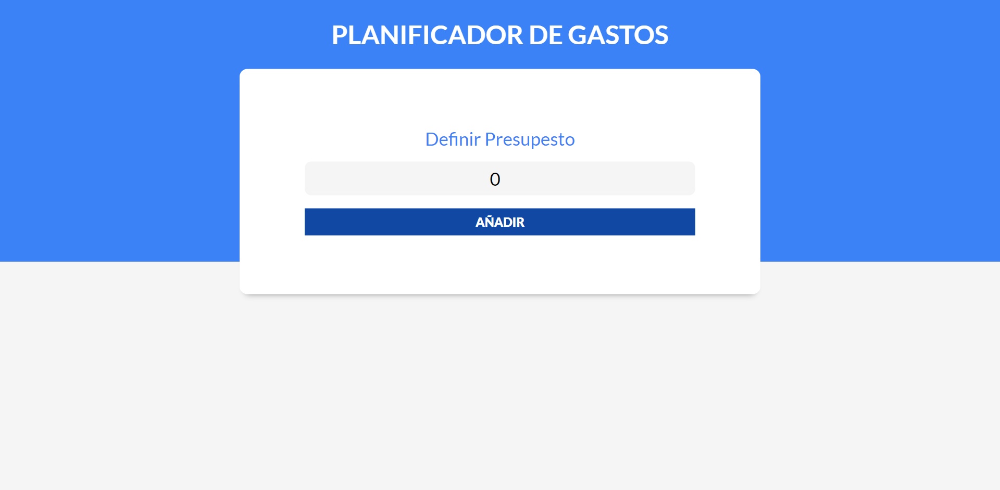
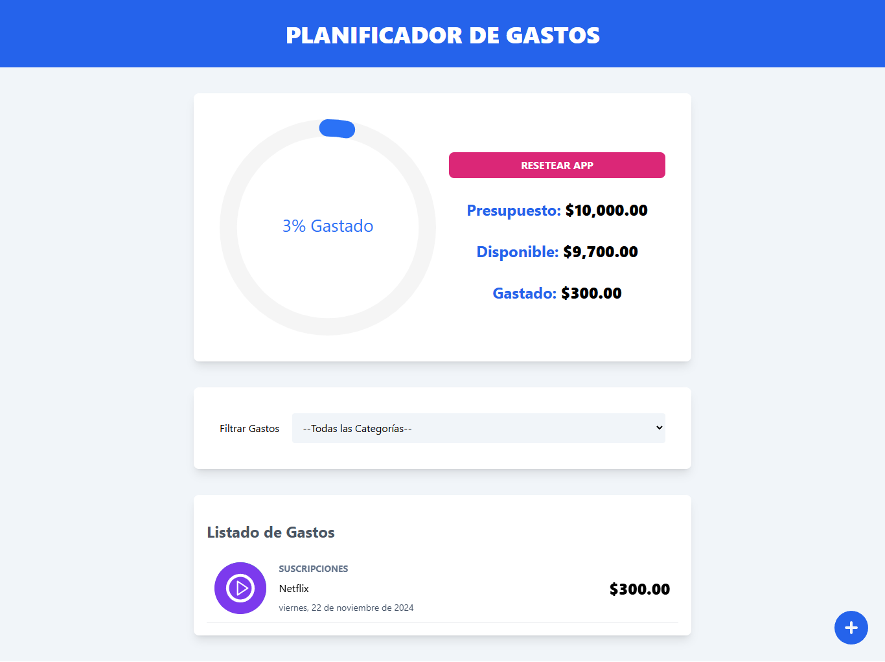

# Control Gastos

imagen de la app (Principal)



Imagen de la app (Detalle de gasto)



#### control de gastos de un presupuesto personal

Esta aplicación permite gestionar y crear presupuestos personalizados para controlar gastos personales de forma eficiente. Su diseño está pensado para su uso local, proporcionando una solución sencilla para organizar tus finanzas diarias. Aunque funciona perfectamente sin conexión, ofrece el potencial de ser ampliada mediante la integración de una base de datos, lo que permitiría almacenar múltiples presupuestos, realizar análisis históricos y sincronizar información entre dispositivos. Es ideal para quienes buscan una herramienta flexible y con opciones de personalización para mejorar su manejo financiero.

## Tecnologías

- React
- TypeScript
- Tailwind CSS
- Context API
- useReducer
- React Router Dom
- React Hooks

## Desarrollo

### Instalación

```
npm install
```

### Comandos

```
npm run dev
```

### Despliegue

```
npm run build
npm run deploy
```

### Tipados de Datos

```typescript
type ValuePiece = Date | null;
export type Value = ValuePiece | [ValuePiece, ValuePiece];

export type Expense = {
  id: string;
  expenseName: string;
  amount: number;
  category: string;
  date: Value;
};

export type DraftExpense = Omit<Expense, "id">;

export type Category = {
  id: string;
  name: string;
  icon: string;
};
```

### Carpeta Hooks

- useBudget

```typescript
import { useContext } from "react";

import { BudgetContext } from "../context/BudgetContext";

export const useBudget = () => {
  const context = useContext(BudgetContext);
  if (!context) {
    throw new Error("useBudget must be used within a BudgetProvider");
  }
  return context;
};
```

### Carpeta Helpers

```typescript
-index.ts;

export const formatCurrency = (amount: number) => {
  return new Intl.NumberFormat("en-US", {
    style: "currency",
    currency: "USD",
  }).format(amount);
};

export const formatDate = (date: string): string => {
  const dateObj = new Date(date);
  const options: Intl.DateTimeFormatOptions = {
    weekday: "long",
    year: "numeric",
    month: "long",
    day: "numeric",
  };

  return new Intl.DateTimeFormat("es-ES", options).format(dateObj);
};
```

### Carpeta data

```typescript
-categories.ts;

import type { Category } from "../types";

export const categories: Category[] = [
  { id: "1", name: "Ahorro", icon: "ahorro" },
  { id: "2", name: "Comida", icon: "comida" },
  { id: "3", name: "Casa", icon: "casa" },
  { id: "4", name: "Gastos Varios", icon: "gastos" },
  { id: "5", name: "Ocio", icon: "ocio" },
  { id: "6", name: "Salud", icon: "salud" },
  { id: "7", name: "Suscripciones", icon: "suscripciones" },
];
```

### Components

- AmountDisplay (AmountDisplay.tsx)
- BudgetForm (BudgetForm.tsx)
- BudgetTracker (BudgetTracker.tsx)
- ErrorMessage (ErrorMessage.tsx)
- ExpenseForm (ExpenseForm.tsx)
- ExpenseDetail (ExpenseDetail.tsx)
- ExpenseList (ExpenseList.tsx)
- ExpenseModal (ExpenseModal.tsx)
- FilterByCategory (FilterByCategory.tsx)

## Componente principal

- App (App.tsx)

## Estilos

- index.css

  ```css
  @tailwind base;
  @tailwind components;
  @tailwind utilities;

  /*** SWIPE LIST OVERRIDES **/
  .swipeable-list-item__leading-actions,
  .swipeable-list-item__trailing-actions {
    @apply text-white text-lg uppercase font-bold;
  }
  .swipeable-list-item__leading-actions {
    @apply bg-blue-600;
  }
  .swipeable-list-item__trailing-actions {
    @apply bg-pink-600;
  }
  .swipeable-list .swipe-action {
    @apply flex justify-center items-center;
  }
  ```
